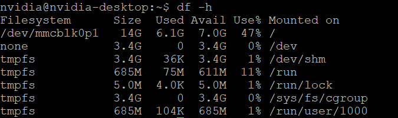

# Nvidia Jetson Minimizing at eMMC 16GB


# 1. **Nvidia install JetPack**

- 기본 JetPack 리눅스 기본 베이스 “Base L4T”만 설치



# USB mount

```bash
# USB의 위치와, 타입 확인
sudo fdisk -l
```


```bash
# USB 마운트 위치 생성
sudo mkdir -p /mnt/data

# 마운트 (USB Device 확인)
sudo mount -t ext4 /dev/sda /mnt/data
## exFAT: -t exfat
## NTFS: -t ntfs
## FAT32: -t vfat
## ext4: -t ext4
	# 포멧에 문제가 있을시 ext4로 변경
	# sudo mkfs.ext4 /dev/sda

# 마운트 확인
df -h
```


# 2. **Removing GUI**


GUI 삭제 용량

- 기본 BSP, L4T/Jetson Linux에 포함된 GUL를 삭제
- LibreOffice 제품 및 Thunderbird 관련 프로그램 삭제
- [nvubuntu-focal-packages_only-in-desktop.txt](https://github.com/NVIDIA-AI-IOT/jetson-min-disk/blob/main/assets/nvubuntu-focal-packages_only-in-desktop.txt) 먼저 설치

```bash
sudo apt-get update
#sudo apt-get purge $(cat nvubuntu-focal-packages_only-in-desktop.txt)
#sudo apt autoremove
sudo apt-get purge libqt5gui5
sudo apt-get purge $(cat nvubuntu-bionic-packages_only-in-desktop.txt)
sudo apt-get install network-manager
```

<aside>
💡 purge로 삭제하면 `SSH` 네트워크도 전부 삭제되기 때문에 반드시`network-manager`를 다시 설치해줘야 한다

</aside>

# 3. **Installing the JetPack Lightweight Version**

- 3번 만 적용 설치 가능

### 1) MDStech에서 알려준 경량화 설치

```bash
# Lightweight version introduced by MDS tech (Not used)
sudo apt depends nvidia-jetpack | awk '{print $2}' | xargs -I {} sudo apt install -y {}
```

### 2) Jetpack USB로 다운로드하고 usr로 설치

```bash
# Just download the jetpack
sudo apt reinstall --download-only -y nvidia-jetpack
sudo mv /var/cache/apt/archives/*.deb /media/ubuntu/data/cache/apt/archives/

# Install the jetpack using USB
sudo apt install /media/ubuntu/data/cache/apt/archives/*.deb
sudo apt .
clean
sudo rm -rf /var/cuda-repo-l4t-10-2-local
```

### 3) USB 심볼릭 링크 사용하여 설치

```bash
# Download jetpack using symbolic links on USB

# local 데이터 USB 복사
sudo cp -r /usr/local/ /mnt/data/local/

# local 폴더 심볼릭 링크 연결
sudo mv /usr/local /usr/local.origin
sudo ln -s /mnt/data/local /usr/ 

# apt archives 심볼릭 링크 연결
sudo mkdir -p /mnt/data/var/cache/apt/
sudo cp -r /var/cache/apt/ /mnt/data/var/cache/apt/
sudo mv /var/cache/apt/ /var/cache/apt.origin
sudo ln -s /mnt/data/var/cache/apt/ /var/cache/

# cuda 포함된 jetpack 설치
sudo apt install nvidia-jetpack

# 설치 관련 내용 삭제
sudo apt clean
sudo rm -rf /var/cuda-repo-l4t-10-2-local
```

# +4. **Removing Docs and Samples code**

- 안지워도 용량은 jetpack 설치 용량이 충분하지만 추가 용량이 필요하면 삭제


Docs, code 삭제 용량

```bash
sudo dpkg -r --force-depends $(dpkg --list | grep -E -o 'cuda-documentation-[0-9\-]*') \
                             $(dpkg --list | grep -E -o 'cuda-samples-[0-9\-]*') \
                             "libnvinfer-doc" \
                             "libnvinfer-samples" \
                             "libvisionworks-samples" \
                             "vpi.-samples"
```

# +5. **Removing `dev` Packages / Static Libraries**

- 안지워도 용량은 jetpack 설치 용량이 충분하지만 추가 용량이 필요하면 삭제


pack, lib 삭제 용량

```bash
sudo find / -name 'lib*_static*.a' -delete
```

<aside>
💡 개별 라이브러리 파일을 수동으로 제거하는 것보다 아래의 `dpkg -r`명령을 사용하여 패키지 관리자를 사용하여 패키지를 제거하는 것이 좋다

```bash
sudo dpkg -r --force-depends $(dpkg-query -Wf '${Package}\n' \
                             | grep -E "(cuda[^ ]+dev \
                             |libcu[^ ]+dev \
                             |libnv[^ ]+dev \
                             |vpi[^ ]+dev)")
```

</aside>

# 6. Setup Yolo v7

- Jetson Xavier NX
    - The NVIDIA Jetson Xavier NX brings supercomputer performance to the edge in a small form factor system-on-module. Up to 21 TOPS of accelerated computing delivers the horsepower to run modern neural networks in parallel and process data from multiple high-resolution sensors — a requirement for full AI systems.

```bash
sudo apt-get -y update; 
sudo apt-get -y install autoconf bc build-essential g++-8 gcc-8 clang-8 lld-8 gettext-base gfortran-8 iputils-ping libbz2-dev libc++-dev libcgal-dev libffi-dev libfreetype6-dev libhdf5-dev libjpeg-dev liblzma-dev libncurses5-dev libncursesw5-dev libpng-dev libreadline-dev libssl-dev libsqlite3-dev libxml2-dev libxslt-dev locales moreutils openssl python-openssl rsync scons python3-pip libopenblas-dev;

#export TORCH_INSTALL=https://developer.download.nvidia.com/compute/redist/jp/v51/pytorch/torch-1.14.0a0+44dac51c.nv23.01-cp38-cp38-linux_aarch64.whl
export TORCH_INSTALL=https://developer.download.nvidia.com/compute/redist/jp/v50/pytorch/torch-1.12.0a0+2c916ef.nv22.3-cp38-cp38-linux_aarch64.whl
#python3 -m pip install --upgrade pip; python3 -m pip install aiohttp numpy=='1.19.4' scipy=='1.5.3' export "LD_LIBRARY_PATH=/usr/lib/llvm-8/lib:$LD_LIBRARY_PATH"; python3 -m pip install --upgrade protobuf; python3 -m pip install --no-cache $TORCH_INSTALL
pip install numpy=='1.21.0'
pip install --no-cache $TORCH_INSTALL
```

```bash
# 환경변수 설정
sh -c "echo \"export PATH="/usr/local/cuda-11.4/bin:$PATH"\" >> ~/.bashrc"
sh -c "echo \"export LD_LIBRARY_PATH="/usr/local/cuda-11.4/lib64:$LD_LIBRARY_PATH"\" >> ~/.bashrc"
#sh -c "echo \"export LD_PRELOAD="/home/ubuntu/.local/lib/python3.8/site-packages/torch/lib/libgomp-d22c30c5.so.1"\" >> ~/.bashrc"

# 기본 패키지 설치
sudo apt install -y python3-pip git
pip install pandas tqdm matplotlib seaborn scipy
```

```bash
pip install --upgrade setuptools pip --user
pip install --ignore-installed PyYAML
pip install Pillow

pip install nvidia-pyindex
#pip install --upgrade nvidia-tensorrt
pip install pycuda

pip install protobuf<=4.21.3
#pip install onnxruntime-gpu
pip install onnx>=1.9.0
pip install onnx-simplifier>=0.3.6 --user

pip install nvidia-pyindex
pip install onnx-graphsurgeon
```
